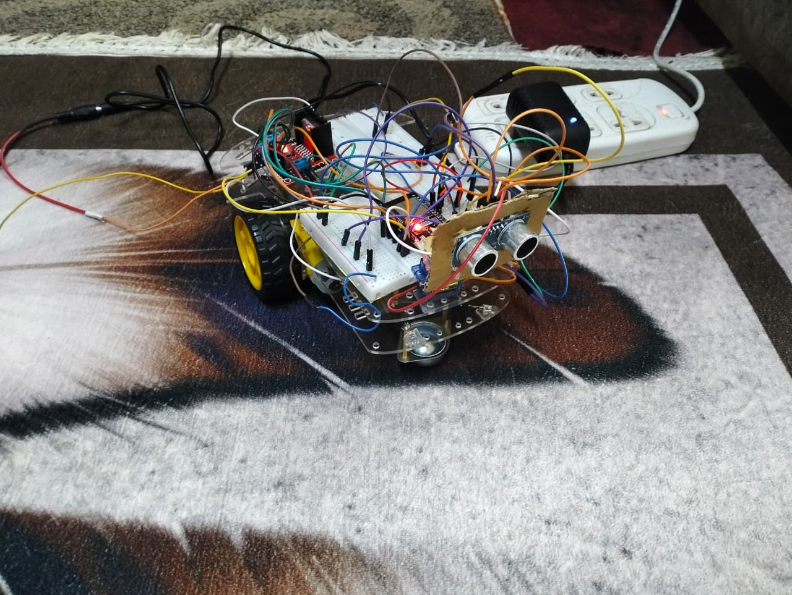
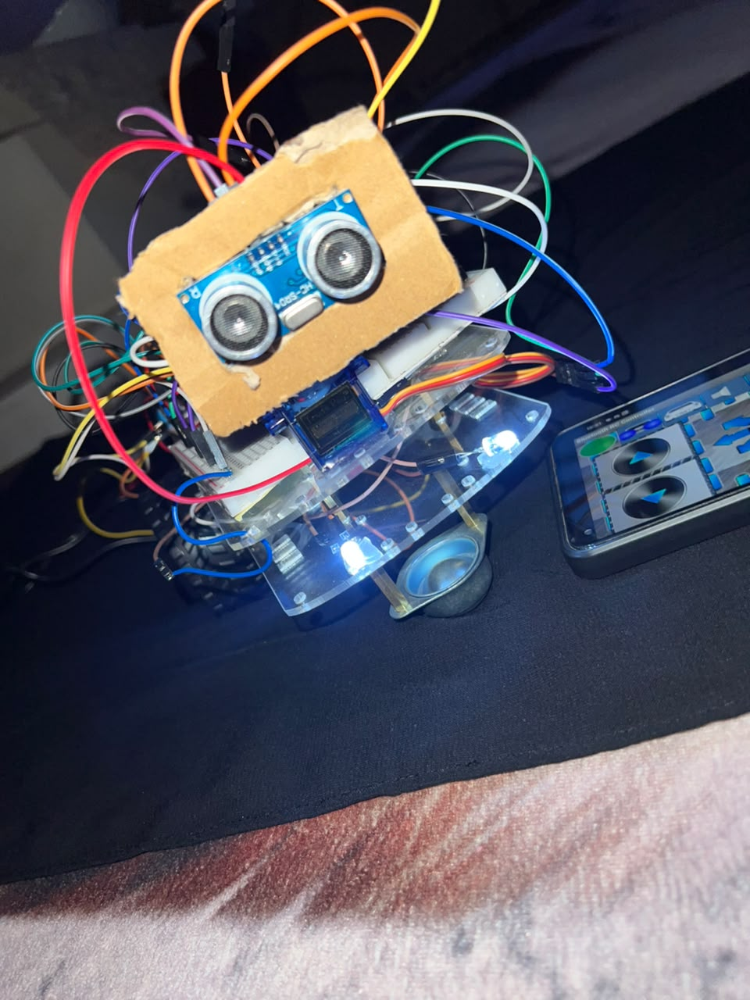
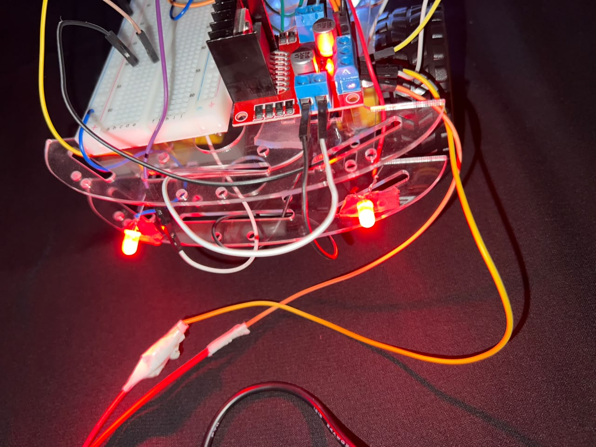
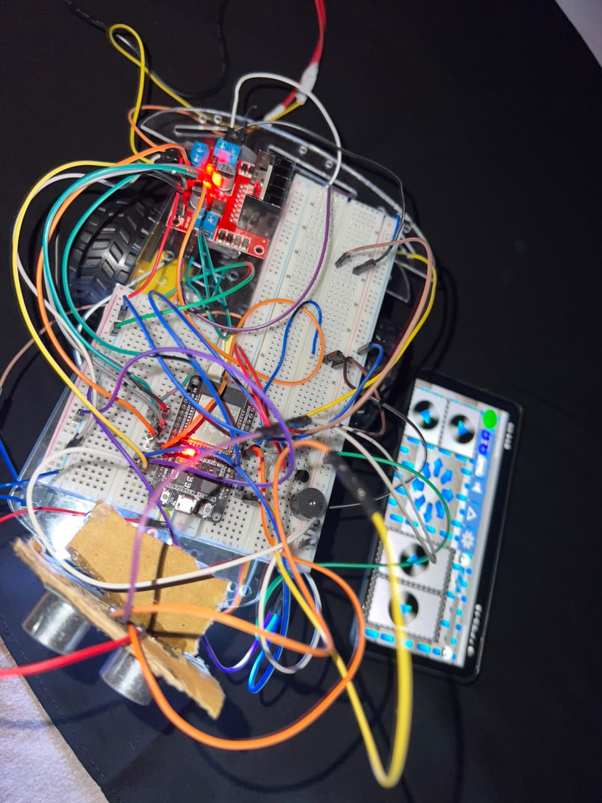
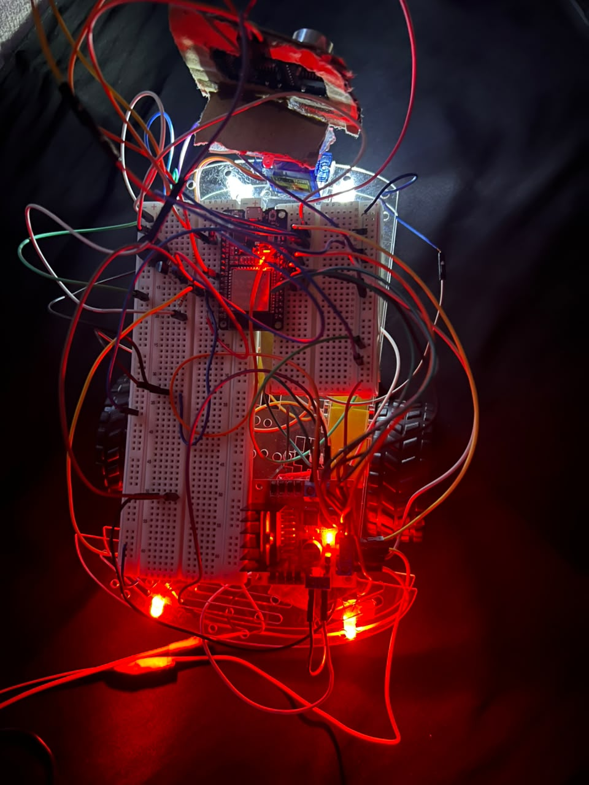
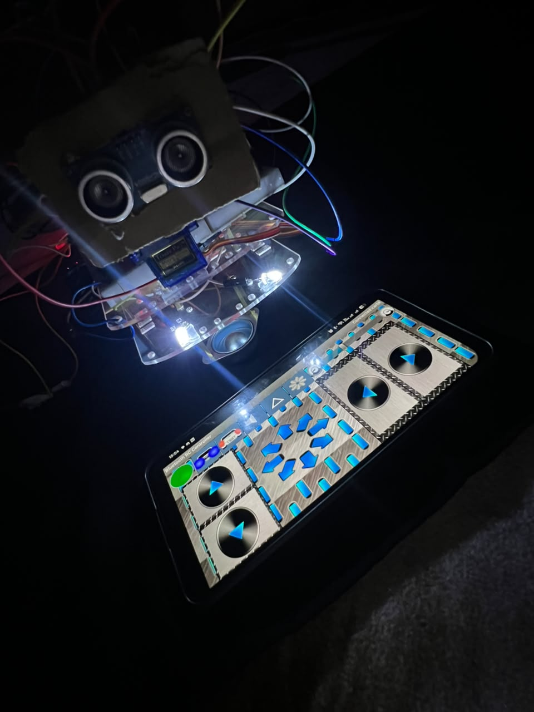

# 🚗 ESP32 Bluetooth RC Car

An ESP32-powered RC car with Bluetooth control, a steerable ultrasonic obstacle-avoidance system, adjustable speed, front/back lighting, and a horn — built by **Team Vincere**.

## Overview

This project turns a standard RC car chassis into a smart, Bluetooth-controlled vehicle using an ESP32 as the main controller. Movement is controlled from a phone via a standard Bluetooth RC car app, while the ESP32 independently handles obstacle detection, lighting, and speed logic in real time.

## Photos

## Features

- 🎮 **Bluetooth control** — drive forward, backward, and turn using any standard Bluetooth RC car app
- ⚡ **7-level speed control** — adjustable PWM speed from the app
- 🛡️ **Steerable obstacle avoidance** — the ultrasonic sensor sits on a servo mount that the driver can aim from the app (0–180°), and the car auto-stops if it detects an object within 20cm in that direction while moving forward
- 💡 **Front & back lights** — independently toggled from the app
- 📯 **Horn** — two-tone buzzer sound
- 🔀 **Differential steering** — smooth turning by varying speed between left/right motors independently, rather than a mechanical steering system

## Hardware

| Component | Purpose |
|---|---|
| ESP32 | Main controller (Bluetooth + PWM + sensor logic) |
| L298N (or similar) motor driver | Drives 2 DC motors |
| HC-SR04 ultrasonic sensor | Obstacle detection, mounted on a servo |
| SG90 (or similar) servo | Aims the ultrasonic sensor |
| 2x LEDs | Front & rear lighting |
| Buzzer | Horn |

## Obstacle Avoidance — How It Works

This was the part of the build that took the most iteration to get right:

1. The driver aims the ultrasonic sensor by adjusting a slider in the app — the ESP32 maps that input (0–9) to a servo angle (0–180°)
2. On every loop cycle, the ESP32 pings the ultrasonic sensor in whatever direction it's currently pointed and measures the return time with `pulseIn()`
3. If the measured distance is under 20cm **and** the car is currently moving forward (or turning forward-left/forward-right), the ESP32 immediately force-stops the motors and resets the movement command — overriding whatever the app was telling it to do
4. If nothing is in range, `pulseIn()` would normally block for up to ~1 second waiting for a signal that never comes — which was silently freezing the Bluetooth control loop. This was fixed with a 30ms timeout on the read, so an empty read never stalls the car

The result is a sensor the driver can actively point where they're steering, rather than a fixed forward-only trip wire.

## Engineering Notes

A few real bugs were caught and fixed during development:
- **GPIO34 is input-only** on the ESP32 and can't drive PWM — the speed-control pin was moved to GPIO32
- **`pulseIn()` had no timeout**, which could block the entire loop for up to 1 second when no echo returned, freezing Bluetooth control — fixed with a 30ms timeout (see above)
- **Speed-of-sound constant was slightly off** (0.035 instead of 0.034 cm/µs), throwing off distance readings
- A function name typo was blocking compilation entirely

## Team Vincere
Built as part of our training at EnGate Academy.

## Demo
🎥 See it driving and auto-stopping in action: [[demo video link]](https://drive.google.com/file/d/1EoLYZNWGEeE1WPsJ2xUievyFH06bK68c/view?usp=drivesdk)
